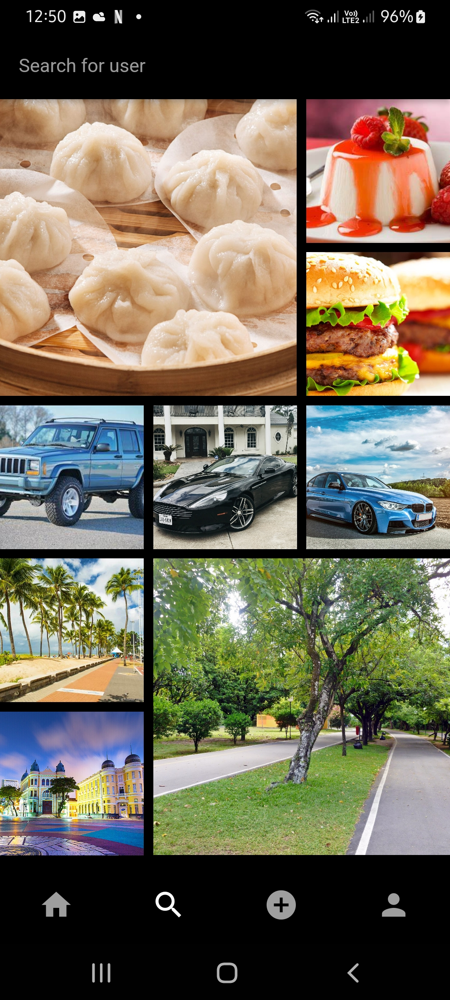
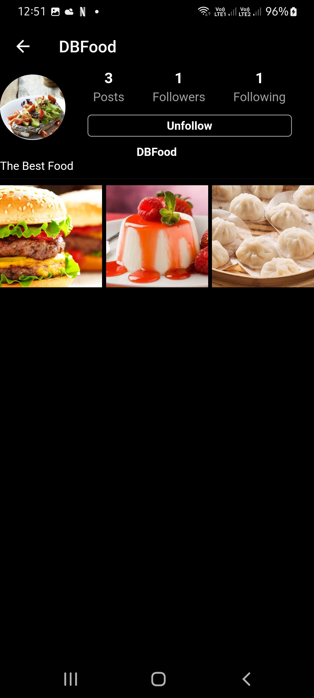
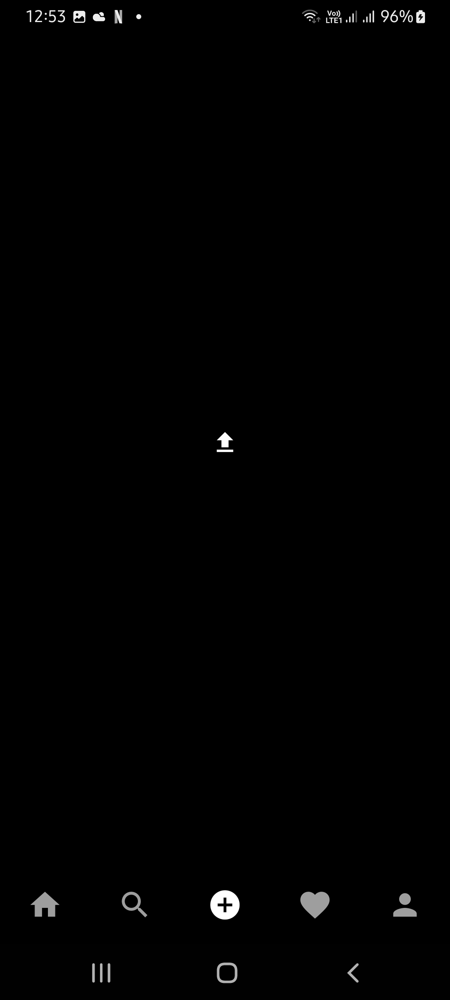
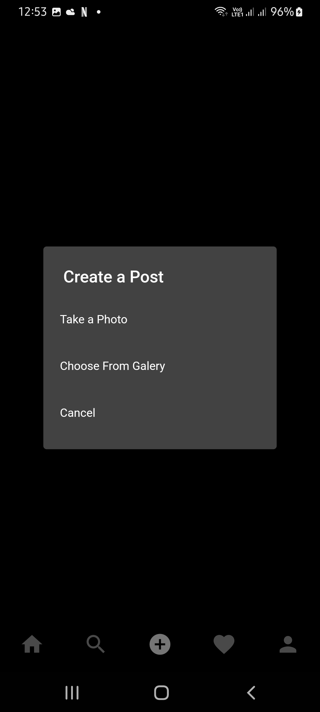
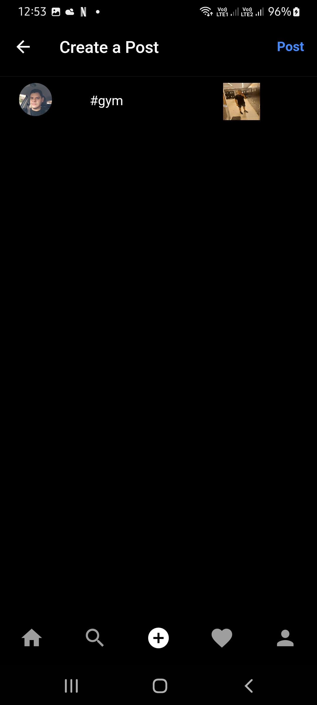
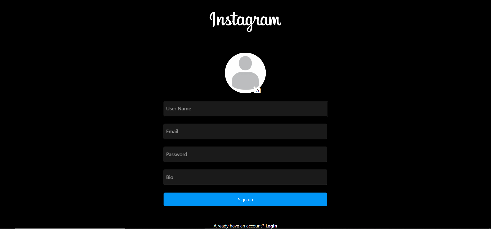
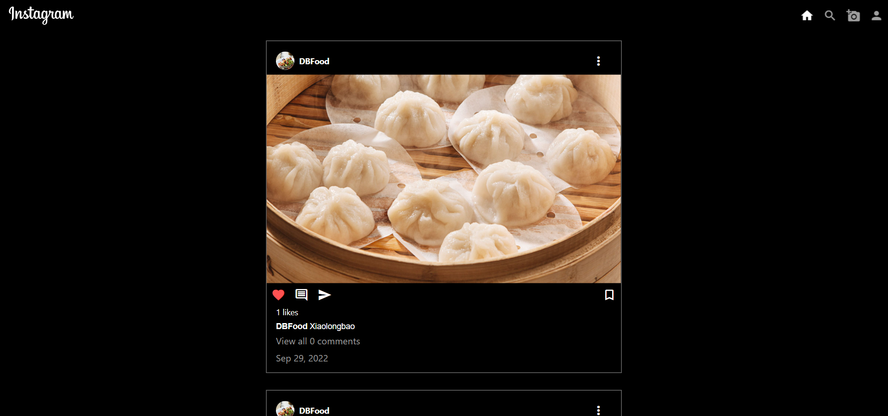
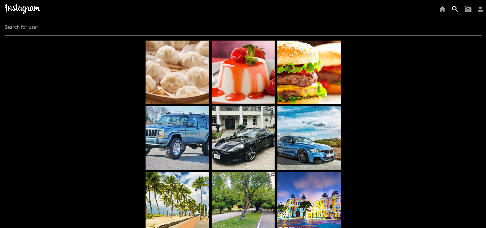
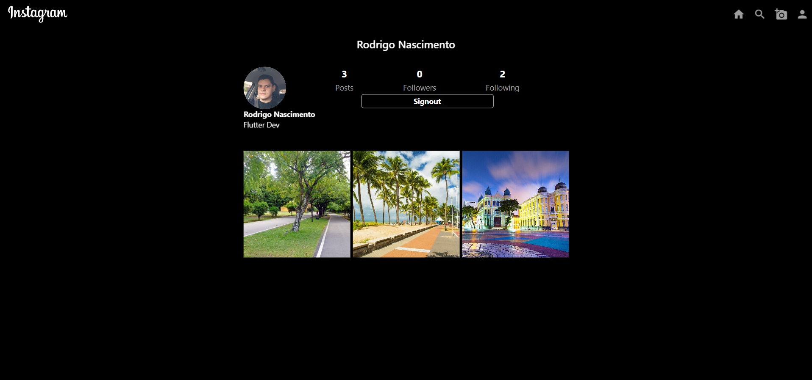
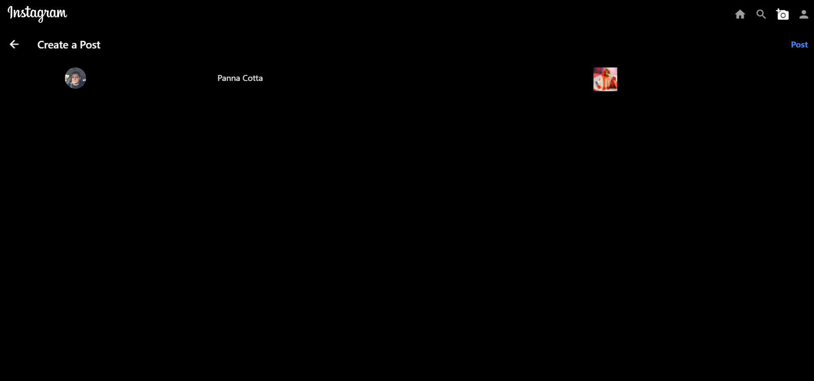

# Instagram Clone

Hello there.
This is a Instagram clone developed in flutter.
This app was developed according to the classes of:

Flutter & Firebase Tutorial: Build 5 Social Media Apps - UDEMY;

### Versions

- **Flutter**: 3.0.5
- **Dart**: 2.17.6

### Setup

Clone it in your machine:
```bash
git clone https://github.com/RodrigoNP3/Instagram_Clone.git
```

Dependecies:

```bash
dependencies:
  cloud_firestore: ^3.4.9
  cupertino_icons: ^1.0.2
  firebase_auth: ^3.10.0
  firebase_core: ^1.23.0
  firebase_storage: ^10.3.9
  flutter_svg: ^1.1.5
  image_picker: ^0.8.5+3
  provider: ^6.0.3
  uuid: ^3.0.6
  intl: ^0.17.0
  flutter_staggered_grid_view: ^0.4.1
```

Firebase Setup:

1 - Create a new firebase project in the firebase console;
You can deactivate the Google Analytics.

2 - Setup authentication by email/password;

3 - Create a Firestore Database;

Change the rules from:

```bash
rules_version = '2';
service cloud.firestore {
  match /databases/{database}/documents {
    match /{document=**} {
      allow read, write: if
          request.time < timestamp.date(2022, 10, 31);
    }
  }
}
```

Change to:

```bash
rules_version = '2';
service cloud.firestore {
  match /databases/{database}/documents {
    match /{document=**} {
      allow read, write: if request.auth != null;
    }
  }
}
```

4 - Create a Storage Database;

Change the rules from:

```bash
rules_version = '2';
service firebase.storage {
  match /b/{bucket}/o {
    match /{allPaths=**} {
      allow read, write: if false;
    }
  }
}
```

Change to:

```bash
rules_version = '2';
service firebase.storage {
  match /b/{bucket}/o {
    match /{allPaths=**} {
      allow read, write: if request.auth != null;
    }
  }
}
```

5 - Create an iOS app;

Apple bundle id:
com.example.instagramFlutter

Download the GoogleService-Info.plist and put it in the Runner folder.

ios>Runner>GoogleService-Info.plist

You can skip the next iOS app creation steps.

6 - Create an Android app;

Android package name:
com.example.instagram_flutter

Download the google-services.json and put it in the app folder.

android>app>google-services.json

You can skip the next Android app creation steps.

6 - Create an Web app;

In the main.dart file put you firebase configurations

```bash
    await Firebase.initializeApp(
      options: const FirebaseOptions(
        apiKey: 'YOUR apiKey',
        appId: 'YOUR appId',
        messagingSenderId: 'YOUR messagingSenderId',
        projectId: 'YOUR projectId',
        storageBucket: 'YOUR storageBucket',
      ),
    );
```

### Navigation

Mobile:

<table>
<thead>
<tr>
<th align="center">Login Screen</th>
<th align="center">Sign Up Screen</th>
<th align="center">Feed</th>
<th align="center">Search Screen</th>


</tr>
</thead>
<tbody>
<tr>
  
<td align="center">
  <a target="_blank" rel="" href="images/Login_screen.jpg">
        

  </a></td>
  
<td align="center">
  <a target="_blank" rel="" href="images/Signup_screen.jpg">
        

  </a></td>
  
 <td align="center">
  <a target="_blank" rel="" href="images/feed_screen.jpg">
        

  </a></td>
  
<td align="center">
  <a target="_blank" rel="" href="images/search_screen.jpg">
        

  </a></td> 
  

  
<table>
<thead>
<tr>
<th align="center">Profile Screen</th>
<th align="center">Profile Screen</th>
<th align="center">Add Post Screen</th>
<th align="center">Add Post Screen</th>


</tr>
</thead>
<tbody>
<tr>
  
<td align="center">
  <a target="_blank" rel="" href="images/profile_screen.jpg">
        

  </a></td>
  
<td align="center">
  <a target="_blank" rel="" href="images/profile_screen_02.jpg">
        

  </a></td>
  
 <td align="center">
  <a target="_blank" rel="" href="images/add_post_screen.jpg">
        

  </a></td>
  
<td align="center">
  <a target="_blank" rel="" href="images/add_post_screen_02.jpg">
        

  </a></td> 
  

<table>
<thead>
<tr>
<th align="center">Add Post Screen</th>


</tr>
</thead>
<tbody>
<tr>


<td align="center">
  <a target="_blank" rel="" href="images/add_post_screen03.jpg">
        

  </a></td> 

  


<table>
<thead>
<tr>
<th align="center">Login Screen</th>
<th align="center">Sign Up Screen</th>

Web:

</tr>
</thead>
<tbody>
<tr>
  
<td align="center">
  <a target="_blank" rel="" href="images/web/login_screen.png">
        

  </a></td>
  
<td align="center">
  <a target="_blank" rel="" href="images/web/signup_screen.png">
        

  </a></td>

  
  
  
<table>
<thead>
<tr>
<th align="center">Feed</th>
<th align="center">Search Screen</th>


</tr>
</thead>
<tbody>
<tr>
  
<td align="center">
  <a target="_blank" rel="" href="images/web/feed_screen.png">
        

  </a></td>
  
<td align="center">
  <a target="_blank" rel="" href="images/web/search_screen.png">
        

  </a></td>


  
<table>
<thead>
<tr>
<th align="center">Profile Screen</th>
<th align="center">Profile Screen</th>
<!-- <th align="center">Add Post Screen</th>
<th align="center">Add Post Screen</th> -->


</tr>
</thead>
<tbody>
<tr>
  
<td align="center">
  <a target="_blank" rel="" href="images/web/profile_screen.png">
        

  </a></td>
  
<td align="center">
  <a target="_blank" rel="" href="images/web/profile_screen_02.png">
        

  </a></td>


<table>
<thead>
<tr>
<!-- <th align="center">Profile Screen</th>
<th align="center">Profile Screen</th> -->
<th align="center">Add Post Screen</th>
<th align="center">Add Post Screen</th>


</tr>
</thead>
<tbody>
<tr>
  
<td align="center">
  <a target="_blank" rel="" href="images/web/add_post_screen_02.png">
        

  </a></td>
  
<td align="center">
  <a target="_blank" rel="" href="images/web/add_post_screen.png">
        

  </a></td>