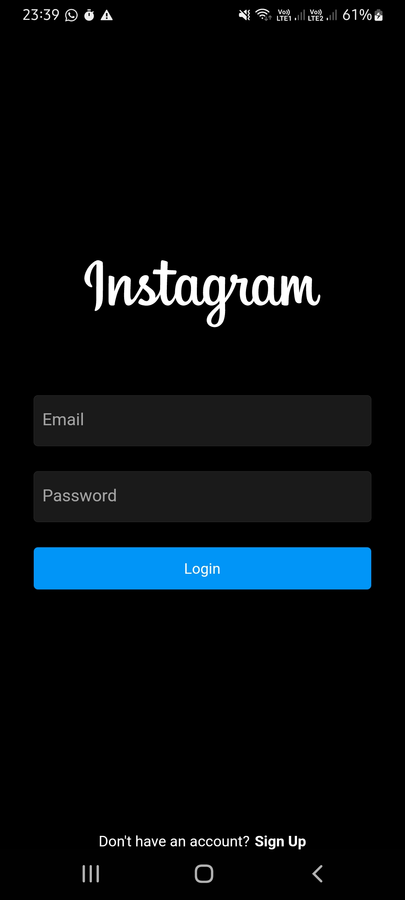
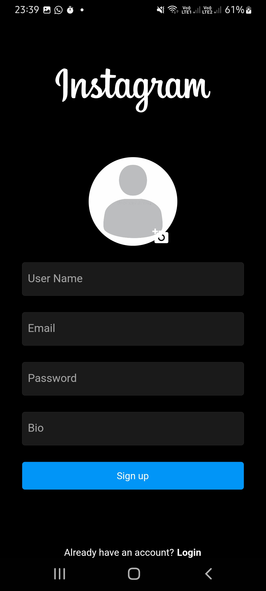

# Instagram Clone

Hello there.
This is a Instagram clone developed in flutter.
This app was developed according to the classes of:

Flutter & Firebase Tutorial: Build 5 Social Media Apps - UDEMY;

### Versions

- **Flutter**: 3.0.5
- **Dart**: 2.17.6

### Setup

Clone it in your machine:
```bash
git clone https://github.com/RodrigoNP3/Instagram_Clone.git
```

Dependecies

```bash
dependencies:
  cloud_firestore: ^3.4.9
  cupertino_icons: ^1.0.2
  firebase_auth: ^3.10.0
  firebase_core: ^1.23.0
  firebase_storage: ^10.3.9
  flutter_svg: ^1.1.5
  image_picker: ^0.8.5+3
  provider: ^6.0.3
  uuid: ^3.0.6
  intl: ^0.17.0
  flutter_staggered_grid_view: ^0.4.1
```

### Navigation

<table>
<thead>
<tr>
<th align="center">Login Screen</th>
<th align="center">Sign Up Screen</th>


</tr>
</thead>
<tbody>
<tr>
  
<td align="center">
  <a target="_blank" rel="" href="images/Login_screen.jpg">
        

  </a></td>
  
<td align="center">
  <a target="_blank" rel="" href="images/Signup_screen.jpg">
        

  </a></td>
  
  
  
